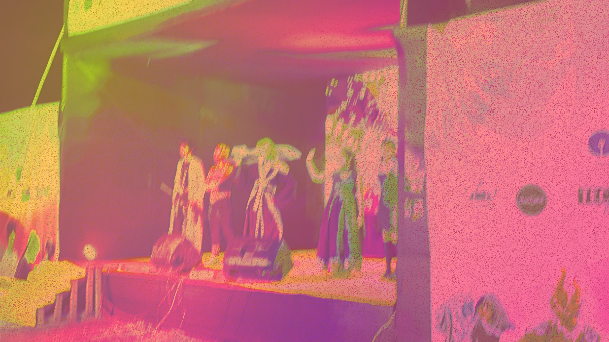

## Overview

This concept explores how a modern investment company can present itself with a more human, confident, and premium visual identity. The layout blends editorial structure with polished product mockups to feel both credible and aspirational.

The challenge was to create a presentation system that balances clarity, trust, and impact—without reducing the story to a flat corporate deck. Instead, the design relies on composition, contrast, and carefully framed imagery to make the brand feel established and forward-looking.

> The result is a presentation page that feels closer to a digital portfolio piece than a standard pitch document.

## Design direction

The visual language draws from Behance-style case-study interfaces: strong typographic hierarchy, large neutral surfaces, and strategic contrast between text and image. The structure is intentionally minimal so the content remains central while still feeling dynamic and premium.

We used:

- strong editorial headline treatment
- restrained grayscale backgrounds
- bold image-led storytelling
- clean metadata blocks for project context
- a polished case-study rhythm for long-form content

## Key outcome

The final composition makes the work feel like an end-to-end brand presentation rather than a generic portfolio grid. It lets the project breathe, supports narrative pacing, and gives the viewer a clear sense of the design system behind the story.

<div class="media-grid">
  
  
</div>

## Process

The project moved through a few distinct stages:

1. Clarify the brand narrative and what needed to feel premium.
2. Define the editorial rhythm and required information density.
3. Build the visual system with image-led panels and simple supporting text.
4. Tune spacing, contrast, and type scale to preserve clarity while keeping the composition expressive.

This process helped keep the project grounded while allowing the presentation to feel elevated and contemporary.

<div class="full-bleed">
  
</div>

## Conclusion

The result is a premium presentation page that feels authored rather than templated. It gives the work room to breathe, while still maintaining an unmistakably design-forward, presentation-ready structure.

```ts
const launchPlan = {
  status: 'ready',
  milestone: 'Q3 launch'
};
```
